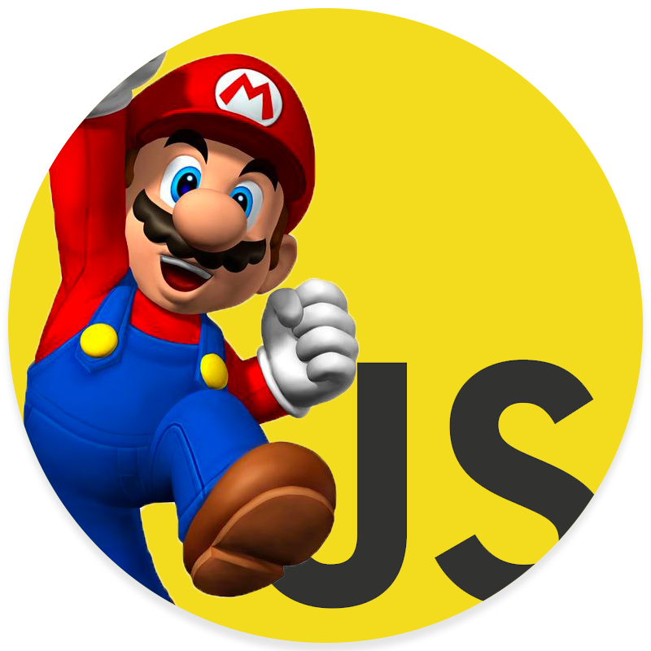

# MarioBroski
> The goal is to reproduce a copy of Super Mario Bros (only pure JS) to use as our portfolio! 🤞

## Usage

To start use

    python -m SimpleHTTPServer 8000
    python -m http.server 8080    # if you have windows or python3

## Other

This project is maintained by [colobwoy](https://github.com/colobwoy) and I.  